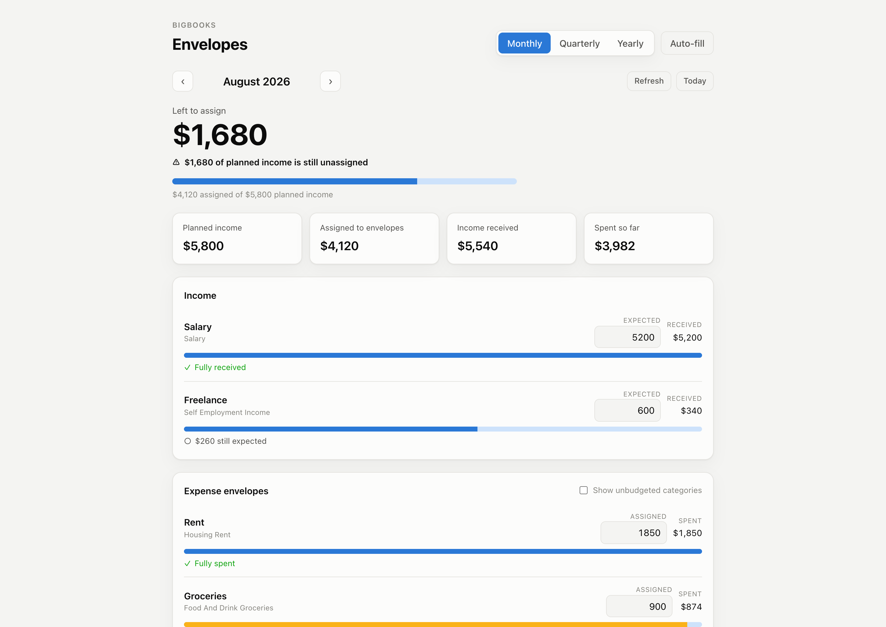
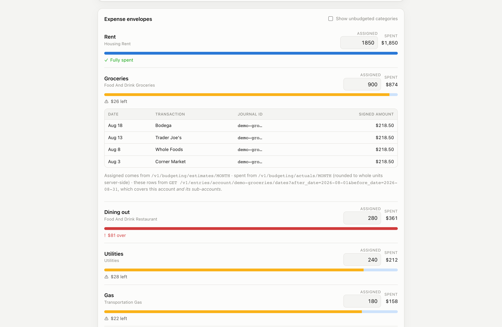

# BigBooks Envelope Budgeting

A zero-based / envelope budgeting app built on the [BigBooks API](https://api.bigbooks.app),
**fully static** — no backend, no build step, just HTML, CSS, and vanilla JS.
Authentication is **OAuth 2.0 Authorization Code + PKCE** entirely in the browser,
so there is no client secret to protect and nothing runs server-side.



<sup>Screenshots from `#demo` mode — synthetic envelopes, no account needed.</sup>

It shows:

- **Left to assign** — planned income minus everything assigned to an envelope,
  the one line zero-based budgeting is about. Pinned at the top, recomputed on every edit.
- **Income and expense envelopes** with an editable assignment, what actually moved,
  and a meter showing how much of the envelope is used
- **Monthly / quarterly / yearly** periods, with ‹ › stepping through them
- **Auto-fill** from BigBooks' own category history, optionally rolling last period's
  surplus or deficit forward
- **Link a bank/card account via Plaid** — the "+ Link account" button (and the
  first-run empty state) opens Plaid Link and connects the institution
- A **provenance drawer** on every envelope: the individual entries and journal ids
  behind the number, plus the exact requests that produced each figure

That last one is the point of a sample rather than a product clone — every figure on
screen can be traced back to the API objects that produced it.



## Envelopes are the budgeting API, not a convention layered on top

BigBooks already models this domain, so the app uses it directly rather than inventing
a representation:

| Concept | What it is in BigBooks |
| --- | --- |
| An envelope | An **income or expense account** — categories are accounts (`accountType` `REVENUE` / `EXPENSE`) |
| What you assigned to it | A **budget** over a date range — `GET /v1/budgeting/estimates/{time_period}` |
| What actually moved | The **sum of that account's entries** in the period — `GET /v1/budgeting/actuals/{time_period}` |
| Assigning money | `PUT /v1/budgeting/budget` |

There is a second way to build an envelope system on a double-entry ledger — model each
envelope as an equity account and move money with compound journals, so rollover falls
out of the ledger itself. That is a legitimate design, and it is what you'd reach for if
you wanted balances that carry forward automatically. It also leaves `/v1/budgeting/*`
entirely unused, which is the opposite of what a sample should demonstrate. This app takes
the first road; rollover is available explicitly through auto-fill's rollover options.

## How it works

```
Browser (this static app)
  │  1. Authorization Code + PKCE  ──►  www.bigbooks.app/oauth2/authorize + /oauth2/token
  │  2. GET /oauth2/userInfo       ──►  the `bigbooks:party` claim (your party id)
  │     (skipped when the id_token already carries the claim)
  │  3. GET /v1/budgeting/estimates/{period}  ──►  what you assigned, per account
  │  4. GET /v1/budgeting/actuals/{period}    ──►  what actually moved, per account
  │  5. PUT /v1/budgeting/budget              ──►  assign / reassign / clear an envelope
  │  6. POST /v1/budgeting/autofill           ──►  fill every envelope from history
  └► GET /v1/entries/account/{uuid}/dates     ──►  the entries behind one envelope
```

### Linking accounts (Plaid)

Envelopes are income and expense categories, and categories come from transactions — so
the first thing a new account needs is a linked institution. The app loads Plaid's Link
SDK (`cdn.plaid.com`) and drives the standard flow. No Plaid credentials go in the browser
— BigBooks calls Plaid server-side with the client id and secret **you** stored on your
account (see [Bring your own Plaid credentials](#bring-your-own-plaid-credentials)):

```
Click "+ Link account"
  │  POST /v1/plaid/public/token               ──►  { token }  (a Plaid Link token)
  │  Plaid.create({ token }).open()            ──►  user authenticates with their bank
  │  onSuccess(public_token, metadata)
  │  POST /v1/plaid/access/token               ──►  server exchanges + saves the item
  │     { publicToken, party, linkSessionId, webhook, institution, accounts }
  └► reload the budget
```

**The exchange does not import transactions inline.** It saves the item; import is driven
by Plaid's webhook afterwards. So envelopes appear over the following moments rather than
on the next render — the app says so and offers a **Refresh** button instead of pretending
the budget is empty. `webhook` is a required field on the exchange body and must be the
API's own `…/v1/plaid/webhook`, which is the same URL BigBooks registers for itself when
it mints the Link token, so it follows `CONFIG.API`.

Reads and writes that operate on a tenant send `X-Acting-Party-ID: <your party id>`.
Item-level calls (`PUT /v1/budgeting/budget`, the entries drawer) derive tenancy from the
account they address and take no header. The access token lives only in `sessionStorage`
for the current tab.

### The zero-based line

```
planned income   = Σ estimates where accountType = REVENUE
assigned         = Σ estimates where accountType = EXPENSE
left to assign   = planned income − assigned          ← the hero figure; the goal is 0
```

`actuals` supplies the other half — income received and money spent — so each envelope
shows assigned vs. actual side by side.

## Things worth knowing before you copy this code

These are real behaviors of the API that shaped the app:

- **`PUT` with a null `amount` deletes.** `PUT /v1/budgeting/budget` is a full upsert:
  an item whose `amount` is `null` deletes that account's budgets in the range. The app
  leans on this deliberately — clearing the input removes the envelope's budget — but a
  serializer that emits nulls by default will delete budgets it only meant to leave alone.
  Use `POST` if you never intend deletion.
- **Budgets are stored per day.** `createOrUpdateBudget` spreads the amount you send
  evenly across every day in `afterDate…beforeDate`, rounding each day to cents. The
  period total you read back can therefore differ from what you wrote by a few cents.
  The app re-reads after every save instead of trusting its optimistic value.
- **Actuals and estimates are rounded to whole units** server-side. The entries in the
  provenance drawer are not, so their sum can differ from the rounded figure above it.
- **The entries drawer covers sub-accounts.** `/v1/entries/account/{uuid}/dates` returns
  entries for the account *and its children*, so a parent category's total is legitimately
  larger than the sum of its own direct entries.
- **Signs are natural per account type.** A spend on an expense account is positive and
  income on a revenue account is positive, so budget and actual compare directly with no
  sign juggling.
- **`actuals` is the authoritative account list.** It returns every income and expense
  account including ones with no activity; `estimates` returns only accounts that have a
  budget. The app unions them so a budgeted-but-idle envelope still appears.

## Bring your own Plaid credentials

**BigBooks does not ship Plaid credentials and will not spend anyone else's.** Linking an
account calls Plaid with **a client id and secret you stored yourself**, and the Plaid
usage is billed to your Plaid account.

Add them at **<https://www.bigbooks.app/data-secrets>** (sign-in required) — the page takes
a **Plaid client ID** and a **Plaid secret**, which you get from the
[Plaid dashboard](https://dashboard.plaid.com/developers/keys). Without them, the very
first call of the link flow fails with `500 internal_error` and the message
*"Plaid secret could not be resolved"*.

Two details worth internalising:

- Credentials are stored **per party**, and the party that matters is the one that **owns
  the OAuth client** this app signs in with — the account you were signed in as at
  <https://www.bigbooks.app/clients> when you created the client. Register the client under
  one account and store the credentials under another and linking fails.
- There is **nowhere in this repository to put a Plaid secret**, and that is deliberate.
  Anything in `config.js` ships to every browser that loads the page. The API does accept
  `X-Plaid-Client-ID` and `X-Plaid-Secret` headers as a fallback for server-side callers,
  but stored credentials take precedence over them and a browser app must never send them.

Your Plaid account's **environment matters too**: sandbox credentials only open sandbox
institutions (use Plaid's test logins), production credentials need Plaid to have approved
your account for production access.

## Setup

### 1. Register a public OAuth client

Create one at **<https://www.bigbooks.app/clients>** (sign-in required). New clients are
**public** (`token_endpoint_auth_method: none`) with PKCE required by default. Configure:

- **Redirect URI**: the exact URL you'll serve this app from, e.g. `http://localhost:5173/`
- **Scopes**: `openid profile email` — `openid` is required, since the app reads your party
  id from the `bigbooks:party` claim

> **CORS.** The API (`https://api.bigbooks.app/v1/`) allows any origin. The authorization
> server's `/oauth2/token` and `/oauth2/userInfo` allow only origins derived from active
> clients' **registered redirect URIs** — so registering the redirect URI is all it takes,
> there is no separate origin field. The allow-list updates within about a minute.
> Note that `http://localhost:5173` and `http://127.0.0.1:5173` are different origins, and
> pages opened via `file://` send `Origin: null`, which can never be allowed.

### 2. Store your Plaid credentials

At **<https://www.bigbooks.app/data-secrets>**, signed in as the account that owns the
client from step 1. See [Bring your own Plaid credentials](#bring-your-own-plaid-credentials)
above. Skip this only if you do not intend to link an account — with no linked institution
there are no transactions, so there are no categories to budget against.

### 3. Configure the client id

Edit [`public/config.js`](public/config.js) and set `CLIENT_ID`:

```js
export const CONFIG = {
  CLIENT_ID: 'your-public-client-id',
  // ...everything else defaults to the production hosts
};
```

### 4. Serve the `public/` folder

Any static file server works — the app just needs `http://` (ES modules and OAuth
redirects don't work from `file://`):

```bash
python3 -m http.server 5173 --directory public
```

Then open <http://localhost:5173> and click **Sign in with BigBooks**. The URL, port, and
path must match the redirect URI you registered in step 1.

## Demo mode (no account needed)

To preview the UI with synthetic envelopes and no sign-in, open:

```
http://localhost:5173/#demo
```

Amounts stay editable so you can watch the zero-based line recompute; nothing is saved,
and account linking is disabled.

## Project layout

```
public/
  index.html    # markup + auth gate + auto-fill dialog
  styles.css    # theming (light/dark), palette, meters, layout
  config.js     # ← your CLIENT_ID and endpoints
  app.js        # PKCE auth, budgeting calls, Plaid Link, rendering, provenance drawer
openapi.json    # the BigBooks API spec, for reference
docs/           # the README screenshots
.claude/
  launch.json   # convenience config to serve public/ on :5173
```

## API endpoints used

| Purpose | Endpoint |
| --- | --- |
| Your party id | `GET /oauth2/userInfo` → `bigbooks:party` |
| What you assigned | `GET /v1/budgeting/estimates/{time_period}?after_date=…&before_date=…` |
| What actually moved | `GET /v1/budgeting/actuals/{time_period}?after_date=…&before_date=…` |
| Assign / clear an envelope | `PUT /v1/budgeting/budget` |
| Fill every envelope from history | `POST /v1/budgeting/autofill` |
| Entries behind one envelope | `GET /v1/entries/account/{uuid}/dates?after_date=…&before_date=…` |
| Start Plaid Link | `POST /v1/plaid/public/token` → `{ token }` |
| Finish Plaid Link | `POST /v1/plaid/access/token` (exchange public token, save item) |

Further reading: the [integrator guide](https://api.bigbooks.app/docs/integrator-guide.md)
covers tenancy, concurrency, errors, and pagination conventions across every endpoint.

## See also

[networth-dashboard-sample](https://github.com/BigBooksApp/networth-dashboard-sample) — the
same static-app pattern over balance sheets, accounts, and Plaid Link.
